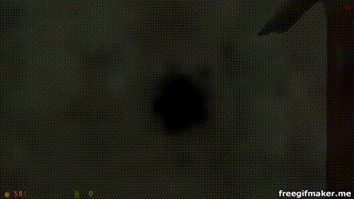

<div align="center">



# Crowbar ⚡
*Next-Generation Data Transformation, Structure-Preserving Mutation & Evolutionary Testing Framework for Crystal*

[](https://github.com/sol-vin/crowbar/actions/workflows/ci.yml)
[](https://crystal-lang.org)
[](LICENSE)
[](https://sol-vin.github.io/crowbar/)

*Pure Crystal. Zero external C/binary dependencies. Native Windows, Linux, and macOS support.*

</div>

---

## Overview

**Crowbar** is a modern, extensible data transformation, structure-preserving mutation, and feedback-driven test generation engine for [Crystal](https://crystal-lang.org).

Inspired by the versatility of general-purpose mutation engines and modern property-based testing, Crowbar operates both as a **high-throughput UNIX streaming filter** (`cat input | crowbar > output`) and a **deeply customizable, type-safe Crystal DSL**.

### Key Features

- 🧬 **Feedback-Driven Evolutionary Search (Genetic Algorithm)**: Callers can report execution outcomes (`fuzzer.report(candidate, fitness)`) back to the engine. Uses tournament/roulette selection and crossover recombination to evolve inputs toward maximizing coverage and depth.
- 🔄 **Anti-Stagnation & Loop Prevention**: Built-in $\epsilon$-greedy exploration rate (guaranteed fresh random inputs) and novelty injection (automatic local minima clearing) prevents the optimizer from locking into repetitive loops.
- 📐 **Structure-Preserving Rules (10 Formats)**:
  - **`JSON`**: Mutates AST leaf nodes (numbers, strings, booleans, arrays, keys) while guaranteeing 100% syntactically valid JSON output.
  - **`YAML`**: Transforms scalar values and mappings while preserving document hierarchy and indentation.
  - **`HTTP`**: Mutates headers, query strings, and body payloads while maintaining strict RFC 7230 CRLF framing.
  - **`DNS`**: Wire-format DNS packet mutations (RFC 1035) preserving 12-byte headers and length-prefixed domain labels.
  - **`CSV`**: Tabular record mutations, column swapping/dropping, quote boundaries, and ragged row injection.
  - **`XML`**: AST-level XML/HTML tree manipulation, attribute fuzzing, and CDATA wrapping.
  - **`URL`**: RFC 3986 URI/URL path traversal, query parameter pollution, and port boundaries.
  - **`TLV`**: Type-Length-Value frames with length under/over-reporting and tag corruption.
  - **`Base64`**: Transparent decode-mutate-encode Base64 envelope transformations.
  - **`Varint`**: LEB128/Protobuf 7-bit continuation bit integer stream boundaries.
- 🎯 **Fine-Grained Selectors & Combinators**: Target byte ranges (`scope :header, bytes: 0...16`), columns (`field: 1`), character classes (`chars: :digits`), periodic strides (`stride: 4`), Shannon entropy (`entropy: :high`), or combine with `&`, `|`, and `~`.
- 🔧 **Post-Transform Fixup Hooks**: Automatically recalculate checksums (CRC32, MD5) or payload length fields after mutating body contents.
- 🎲 **Deterministic PRNG (Xoshiro256++)**: Fast 64-bit random state seeded for exact, reproducible test cases across platforms.
- 🎨 **Opal TrueColor Hex Diff & CLI**: Side-by-side terminal hex diff visualization powered by [Opal](https://github.com/sol-vin/opal).
- 📦 **Automated Versioning & Docs**: Integrated with [Carbon](https://github.com/sol-vin/carbon) for monotonic commit versioning and [Jasper](https://github.com/sol-vin/jasper) for multi-track documentation guides.

---

## Installation

Add Crowbar to your `shard.yml`:

```yaml
dependencies:
  crowbar:
    github: sol-vin/crowbar
    branch: master
```

Then run:

```bash
shards install
```

---

## Quick Start (CLI)

Build the standalone `crowbar` binary:

```bash
shards build crowbar
```

### 1. Pipe-In, Pipe-Out (UNIX Filter Mode)

```bash
# Transform data flowing through a pipe
echo '{"user": "alice", "age": 30}' | bin/crowbar --rule json
```

### 2. Opal TrueColor Hex Diff

```bash
# Visually inspect byte-level differences directly in your terminal
bin/crowbar --diff --seed 42 sample.bin
```

### 3. Batch Test Case Generation

```bash
# Generate 100 deterministic test files from sample inputs
bin/crowbar -n 100 -s 1337 -o "fuzz-%n.bin" samples/*.bin
```

### 4. Component Catalog

```bash
bin/crowbar --list
```

---

## Quick Start (Crystal DSL)

### 1. Zero-Config Black-Box Transformation

```crystal
require "crowbar"

sample = "The quick brown fox jumps over the lazy dog 12345"
mutant = Crowbar.fuzz(sample, seed: 42_u64)
puts mutant
```

### 2. Structured Protocol Framing & Length Fixups

```crystal
require "crowbar"

# Modernized protocol fuzzer: 16-byte binary header + JSON body
fuzzer = Crowbar.define do
  seed 0x1337_u64

  # Use multi-pass burst pattern
  pattern :burst

  # Preserve valid JSON structure in body
  scope :body, bytes: 16.. do
    preserve :json
  end

  # Post-mutation fixup hook: automatically recompute payload length!
  fixup do |buffer|
    next if buffer.size < 16
    payload_len = (buffer.size - 16).to_u32
    IO::ByteFormat::BigEndian.encode(payload_len, buffer[0, 4])
  end
end

sample_packet = File.read("packet.bin").to_slice
mutant = fuzzer.fuzz(sample_packet)
```

### 3. Feedback-Driven Evolutionary Optimization

```crystal
require "crowbar"

fuzzer = Crowbar.define do
  seed 42_u64

  evolution do
    enabled true
    population_size 64
    selection :tournament, size: 4
    crossover_rate 0.25
    exploration_rate 0.15 # 15% random exploration to prevent local loops
    stagnation_limit 100  # Inject fresh entropy after 100 stagnant cycles
  end
end

baseline = "SELECT id, name FROM users WHERE age > 18"

1000.times do
  candidate = fuzzer.fuzz(baseline)

  # Evaluate candidate with your target program or parser
  fitness = evaluate_target_coverage(candidate)

  # Report feedback to guide subsequent generations
  fuzzer.report(candidate, fitness: fitness)
end
```

---

## Component Reference

### Structure-Preserving Rules (10 Formats)
| Rule | Format | Strategy |
| :--- | :--- | :--- |
| `json` | JSON Documents | Traverses AST; mutates leaf numbers, strings, keys, and arrays |
| `yaml` | YAML Documents | Preserves document indentation; mutates scalar nodes |
| `http` | HTTP/1.x Messages | Preserves RFC CRLF framing; mutates paths, headers, or body |
| `dns`  | DNS Wire Packets | Preserves 12-byte header and RFC 1035 length-prefixed domain labels |
| `csv`  | CSV/TSV Tabular | Preserves tabular grid; mutates cells, swaps/duplicates columns, ragged rows |
| `xml`  | XML/HTML Documents | Traverses XML DOM; mutates text nodes, attributes, namespaces, CDATA |
| `url`  | URI / Query Strings | Mutates paths, traversal (`../`), query parameters, and port numbers |
| `tlv`  | TLV Binary Frames | Mutates Type-Length-Value frames, length fields, and payload bytes |
| `base64` | Base64 Envelopes | Transparently decodes, applies binary mutations, and re-encodes |
| `varint` | LEB128 Varints | Mutates 7-bit continuation integers, boundary limits, and overlong bytes |

### Mutation Patterns
| Pattern | ID | Description |
| :--- | :--- | :--- |
| `once`  | `od` | Apply exactly one mutation |
| `many`  | `nd` | Apply one or more mutations with geometric probability decay (default) |
| `burst` | `bu` | Apply a localized cluster of several changes |

### Mutator Arsenal (30 Tools)
| Name | ID | Category | Description |
| :--- | :--- | :--- | :--- |
| `ByteDrop` | `bd` | Byte | Drop a single random byte |
| `ByteFlip` | `bf` | Byte | Flip 1-4 bits in a random byte |
| `ByteInsert` | `bi` | Byte | Insert a random byte at a random position |
| `ByteRepeat` | `br` | Byte | Repeat a byte multiple times (log distribution) |
| `BytePermute` | `bp` | Byte | Permute a contiguous window of adjacent bytes |
| `ByteIncDec` | `bei` | Byte | Increment or decrement a byte value mod 256 |
| `ByteRandom` | `ber` | Byte | Replace a byte with a uniform random value |
| `BitFlipRun` | `bfr` | Bit | Flip a contiguous run of 2 to 32 bits across byte boundaries |
| `WalkingBit` | `wb` | Bit | Slide an inverted single bit through target byte window |
| `SequenceRepeat` | `sr` | Sequence | Repeat a sequence of bytes |
| `SequenceDelete` | `sd` | Sequence | Delete a sequence of bytes |
| `SequenceSwap` | `ss` | Sequence | Swap two disjoint sequences of bytes |
| `LineDelete` | `ld` | Line | Delete a line in text-based data |
| `LineDuplicate` | `lr2` | Line | Duplicate a line in text-based data |
| `LineSwap` | `ls` | Line | Swap two lines in text-based data |
| `LinePermute` | `lp` | Line | Permute a contiguous group of lines |
| `TreeDelete` | `td` | Tree | Delete a balanced delimited node `()`, `[]`, `{}`, `<>`, `""`, `''` |
| `TreeDuplicate` | `tr2` | Tree | Duplicate a balanced delimited node |
| `TreeSwap` | `ts1` | Tree | Swap two balanced delimited nodes |
| `TreeStutter` | `tr` | Tree | Repeat a balanced delimited node multiple times |
| `BoundaryNumbers` | `num` | Values | Mutate textual numbers to boundary values or off-by-one |
| `UnicodeEdgeCases` | `ui` | Values | Inject Unicode boundaries, BOMs, surrogates, and BiDi controls |
| `WhitespaceDelimiters` | `wd` | Values | Vary whitespace formatting, line breaks (CRLF/LF), and null characters |
| `ArithmeticScaler` | `scale` | Arithmetic | Scale numbers by factors (2x, 10x, 100x, 0.5x, bit-shifts) |
| `TimestampMutator` | `time` | Arithmetic | Inject temporal epoch boundaries (Y2038, zero epoch, leap days) |
| `CaseFlip` | `cf` | Text | Invert or alternate case (test case-folding and normalization) |
| `HomoglyphMutator` | `homo` | Text | Substitute ASCII letters with confusable Unicode homoglyphs |
| `DictionaryMutator` | `dict` | Text | Insert or replace tokens using vocabulary dictionary |
| `PaddingMutator` | `pad` | Layout | Inject null, whitespace, or alignment padding |
| `TruncationMutator` | `trunc` | Layout | Truncate buffer at logical line, delimiter, or random offset |

### Selectors & Combinators
| Selector | Syntax | Description |
| :--- | :--- | :--- |
| `ByteRange` | `bytes: 0...16` | Static byte index range |
| `Header` / `Footer` | `header: 16` / `footer: 8` | Prefix or suffix byte slices |
| `DelimitedField` | `field: 1, delimiter: ','` | N-th column or token in delimited records |
| `CharacterClass` | `chars: :digits` | Contiguous digits, hex, alpha, or printable runs |
| `Stride` | `stride: 4, offset: 0` | Periodic byte slices at regular intervals |
| `Entropy` | `entropy: :high` | Shannon entropy slices (:high or :low) |
| `JSONKeyPath` | `json_key: "age"` | Byte offsets of specific JSON keys or values |
| `XMLTag` | `xml_tag: "title"` | Inner contents or elements for XML/HTML tags |
| `Combinators` | `sel_a & sel_b`, `\|`, `~` | Logical intersection, union, and inversion |

---

## Development & Testing

Run the automated test suite:

```bash
crystal spec --verbose
```

Verify formatting:

```bash
crystal tool format --check
```

Build Jasper guides and HTML documentation:

```bash
bin/jasper build
crystal docs
```

Audit version consistency with Carbon:

```bash
bin/carbon check
bin/carbon doctor
```

---

## License

MIT License. Copyright (c) 2019-2026 Ian Rash (sol-vin).
